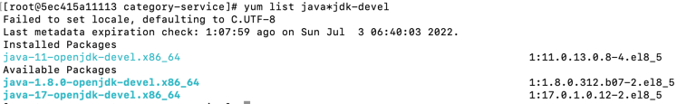
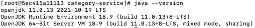
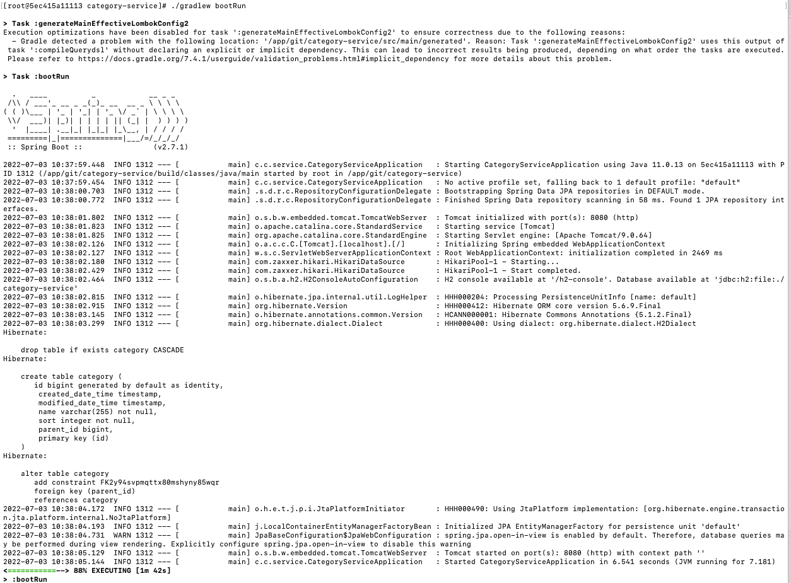

# category-service

## 🏗️ 설치/빌드 방법

### Centos 기준

### Jdk 설치

> // 설치 가능한 jdk 조회  
> yum list java*jdk-devel

> // jdk 11 설치  
> yum install java-11-openjdk-devel.x86_64
> 
> // 정상 설치 확인  
> java --version  

### Java home 설정

> vi /etc/profile
> 
> readlink -f /usr/bin/javac
> 
>export JAVA_HOME=/lib/jvm/java-11-openjdk-11.0.10.0.9-1.el7_9.x86_64
> 
>source /etc/profile
> 
>echo $JAVA_HOME

### Grade 설치

> // unzip 설치  
> yum install unzip  
> yum install wget
> 
> // wget을 이용해서 gradle.zip 가져오기   
> wget https://services.gradle.org/distributions/gradle-7.4.1-bin.zip  
> 
> // /opt/gradle 디렉토리 생성  
> mkdir /opt/gradle  
> 
> // 압축푼 파일 /opt/gradle 경로로 이동  
> unzip -d /opt/gradle gradle-7.4.1-bin.zip
> 
> // 스크립트 실행 가능하도록 설정  
> chmod +x /etc/profile.d/gradle.sh  
> 
> // 설정 후 명령어 입력  
> source /etc/profile.d/gradle.sh

### Git 프로젝트 받기 

> // Git 설치  
> yum install git  
> 
> // Git clone 받을 디렉토리 생성  
> mkdir app  
> mkdir app/git  
>
> // Git 프로젝트 받기   
> cd app/git  
> git clone https://github.com/parkhanbeen/category-service.git  

### 실행

> // 프로젝트 디렉토리로 이동  
> cd /category-service  
> 
> // 프로젝트 빌드  
> ./gradlew clean build  
> 
> // 프로젝트 실행  
> ./gradlew bootRun 또는 java -jar build/libs/category-service.jar

## 🛠 사용 기술

기술|스펙
---|---|
Language| java 11
Framework|Spring Boot
ORM|JPA, Querydsl
Build Tool|Gradle
API 문서|Spring RestDocs
TEST|Junit5, Mockito
Database|H2 db

